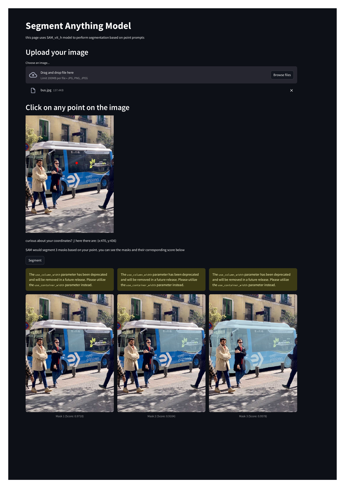

# Segment Anything API & Frontend

This project provides a **FastAPI-based backend** for image segmentation using Meta's **Segment Anything Model (SAM)** and a **Streamlit frontend** to interact with it.
The model uses the ViT-H checkpoint from the Segment Anything Model (SAM). Through the web interface, users can upload an image and select a point as a prompt. The model then generates three segmentation masks along with their corresponding confidence scores.

## Features
- **FastAPI backend** for segmenting images.
- **Streamlit frontend** for an easy UI.
- **Dockerized** for quick deployment.

## Docker Images
Available on **Docker Hub**:
- **Backend**: [`ranakhonsari/sam-backend`](https://hub.docker.com/r/ranakhonsari/sam-backend)
- **Frontend**: [`ranakhonsari/sam-frontend`](https://hub.docker.com/r/ranakhonsari/sam-frontend)

## How to Run  
### Run with Docker Compose
Clone this repo and run:
```bash
docker compose build
docker compose up -d
```
or pull the docker images and run:
```bash
docker compose up -d
```

